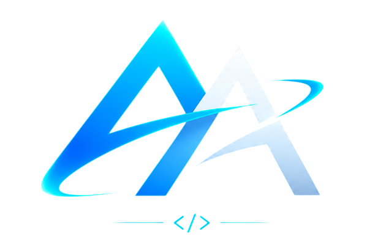

<div align="center">
  
  <h1>Alisson Aguiar — Portfólio Pessoal</h1>
  <p><strong>Desenvolvedor Full Stack | Especialista em UX/UI & E-commerce</strong></p>
  <p>Um portfólio moderno, responsivo e altamente interativo, focado em alta performance e excelência visual.</p>

  <p>
    
    
    
    
  </p>
</div>

<br />

## 🚀 Sobre o Projeto

Este projeto é o meu portfólio pessoal definitivo, construído para atrair tech leads e recrutadores através de um design estético, imersivo e com uma experiência de usuário (UX) excepcional. Toda a arquitetura foi desenhada para provar minhas proficiências em engenharia front-end e componentização avançada no React.

O design adere aos princípios modernos de UI: tipografia voltada a desenvolvedores (**JetBrains Mono** e **Inter**), estética dark-mode, glassmorphism e micro-interações fluidas guiadas por dados físicos de movimento do mouse (scroll velocity, magnetism e tilt effects).

## ✨ Principais Diferenciais e Funcionalidades

- 🎥 **Hero Section Cinematográfica:** Utilização de `<canvas>` com controle de frame de vídeo pelo scroll, permitindo uma navegação imersiva.
- 🍱 **Magic Bento Grids:** Sistema de grid moderno com spotlights radiais reativos ao movimento do cursor.
- 🏛️ **Dome Gallery 3D:** Experiência 3D com biblioteca OGL para mostrar os projetos num ambiente estético esférico, reativo ao arrasto do usuário.
- 📜 **Infinite Drift Wall:** Marquee de rolagem contínua para exibir a grande escala de entregas de desenvolvimento com suavidade.
- 📱 **WhatsApp CTA Dinâmico:** Formulário de contato em modal que compila e direciona nativamente a proposta comercial via WhatsApp Web.
- ⚡ **Alta Performance:** Componentes otimizados e renderização reativa com GSAP e Framer Motion.

## 🛠️ Tecnologias Utilizadas

**Core:**
- React 19
- Vite (Build Tool & HMR)

**Animações & Efeitos 3D:**
- GSAP (GreenSock Animation Platform)
- Framer Motion
- OGL (WebGL framework para a Dome Gallery)

**Ícones & Tipografia:**
- Lucide React
- JetBrains Mono (Tech/Hacker vibe font)
- Inter (Readability/UI font)

## 🧠 Hard Skills Destacadas

Neste ecossistema digital, as seções e copys foram redigidas para comunicar com clareza minha proficiência nos seguintes domínios:

1. **Desenvolvimento Web & Soluções Escaláveis** (Código Limpo e Arquitetura Moderna)
2. **Product UX/UI** (Design System e Prototipagem com foco no usuário)
3. **E-commerce de Alta Conversão** (Nuvemshop, Shopify e WooCommerce)
4. **Plataformas Low-code & Vibecode** (Agilidade e rápida implementação)
5. **SEO Operacional** (Rankeamento orgânico, acessibilidade e performance)
6. **Formação Contínua** (Certificações Oficiais Microsoft: AZ-900, DP-900, AI-900, etc.)

## ⚙️ Como rodar localmente

Clone o repositório e rode o comando abaixo na raiz do projeto:

```bash
# 1. Instale as dependências
npm install

# 2. Inicie o servidor de desenvolvimento
npm run dev
```

O projeto rodará em `http://localhost:5173/`.

---

<div align="center">
  <p>Feito com muita dedicação por <strong>Alisson Aguiar</strong>.</p>
  <a href="https://wa.me/558496572500">Vamos construir algo incrível juntos!</a>
</div>
